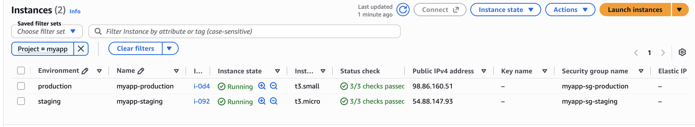
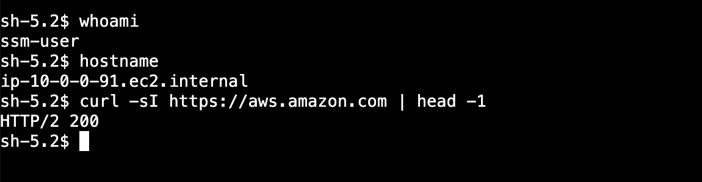
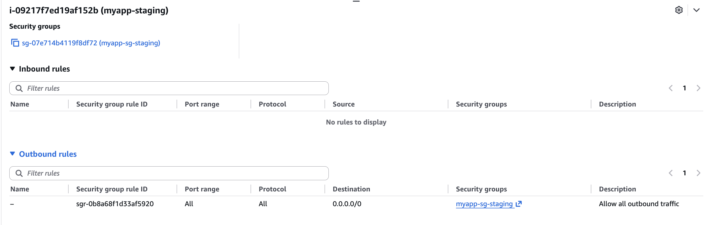
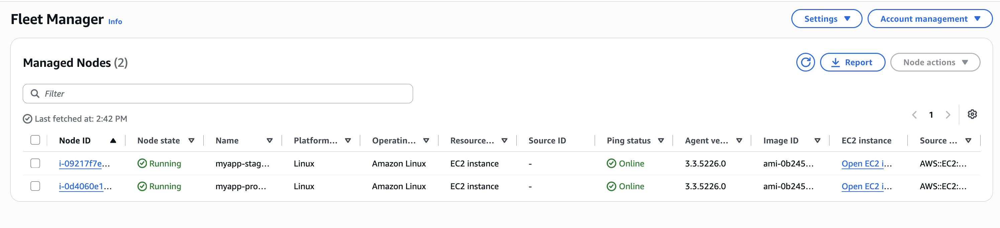
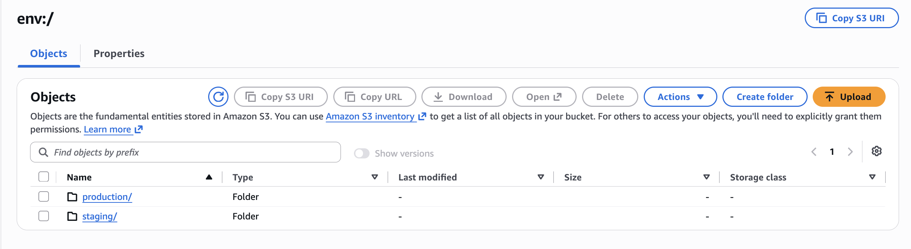

# Terraform AWS Environment

[](https://github.com/liliyapetillo/terraform-aws-environment/actions/workflows/terraform.yml)

A small AWS environment built entirely in Terraform: a VPC, a security
group with no inbound rules, and one EC2 instance reachable only through
Session Manager. The same code deploys isolated staging and production
copies through workspaces. The instance runs nothing interesting; the
project is about the infrastructure-as-code around it: locked remote
state, a hand-written module next to a registry module, and checks that
catch mistakes before `apply` does.

**Why I built it.** My [ECS CI/CD pipeline](https://github.com/liliyapetillo/ecs-cicd-pipeline)
automated how application code reaches production, but its infrastructure
was clicked together in the console. That can't be reviewed in a pull
request, rebuilt exactly, or kept identical across environments. This
project is the other half: the infrastructure itself as code.

**Why it matters.** Cloud teams work in this loop every day: change
Terraform in a branch, let CI check it, apply to staging, then production.
This project covers the parts of that loop that come up in real work and
interviews:

- **Locked remote state**, so two applies can't corrupt it
- **Modules**: when to reuse a community one, when to write your own
- **Environment parity**: staging and production from the same code
- **Keyless, audited access** through Session Manager instead of SSH
- **Early checks** on every push. From my QA background: the cheapest bug
  is the one caught before it ships.

Both environments running from the same code, then a shell on staging
through Session Manager, with no SSH key and no open port:





*(Not kept running to control cost. `terraform apply` brings it back in
a few minutes.)*

## Architecture

Deliberately small: the standard starting shape for an AWS workload. A
planned three-tier follow-up will add a load balancer, private app
servers and a database.


Nothing can connect *to* the instance. Its SSM agent connects out to
Systems Manager, and sessions run back over that channel: no port 22, no
key pair, no bastion.

The security group has no inbound rules at all, only one outbound rule:



Both instances still register with Systems Manager, because the agent
connects out:



Each workspace has its own state, VPC, security group, IAM role and
instance. Destroying staging never touches production.

In the state bucket, each workspace's state lives under its own `env:/`
prefix:



| Workspace  | Instance type | Resource names                                     |
|------------|---------------|----------------------------------------------------|
| staging    | t3.micro      | `myapp-vpc-staging`, `myapp-sg-staging`, ...       |
| production | t3.small      | `myapp-vpc-production`, `myapp-sg-production`, ... |

Full plan for a fresh staging workspace (17 resources):
[docs/terraform-plan-staging.txt](docs/terraform-plan-staging.txt)

## Design decisions

- **Session Manager, not SSH.** Nothing to attack from the internet, no
  keys to manage, every session is recorded in CloudTrail.
- **Public IP instead of a NAT gateway, to save cost.** The SSM agent
  needs a way out. NAT costs about $32/month; a public IPv4 about $3.60.
  With no inbound rules, the public IP accepts nothing.
- **Registry module for the VPC, my own for compute.** VPC routing is
  generic and well tested upstream. The EC2, security group and IAM layer
  is app-specific, so it's a local module.
- **Workspaces, not a folder per environment.** One copy of the code, so
  environments can't drift. Only taking in `staging` or `production` to
  prevent using default.
- **S3 native locking (`use_lockfile`)**, no DynamoDB lock table, as this
  is modern standard. Requires Terraform 1.10+, enforced in `versions.tf`.
- **Instance size set by the workspace**, from the `instance_types` map
  variable (staging `t3.micro`, production `t3.small`), not a `-var` flag
  that can be forgotten.
- **Guardrails:** `instance_type` is limited to `t3.micro`/`t3.small`,
  the `default` workspace fails at plan time, and a postcondition fails
  the apply if the instance has no public IP (without one, SSM can't
  reach it).
- **Tags from one place:** provider `default_tags` add `Project`,
  `Environment` and `ManagedBy` to every resource, VPC module included.
- **AMI from AWS's public Parameter Store path**, not a hardcoded ID or a
  name filter, so it's always the current standard AL2023 image (with the
  SSM agent). `ignore_changes = [ami]` then stops each new AMI release
  from forcing a replacement. To upgrade on purpose:
  `terraform apply -replace=module.compute.aws_instance.app`.
- **CI checks on every push and PR:** `fmt`, `validate`, TFLint.

## What failed while building this

Most were caught by `terraform validate`, CI or code review before the
first apply, which is what those checks are for. One (#4) only showed up
during `apply`.

1. **Module used its own output as input.**
   `environment = module.compute.environment` can't work: a module can't
   depend on itself. Fixed by passing `local.environment`.
2. **Instance profile pointed at the wrong object.** It referenced the
   trust-policy data source instead of the role; `validate` flagged the
   undeclared resource.
3. **SSM would never have connected.** VPC module v5 turns off public IPs
   by default and there's no NAT, so the agent had no way out, and
   `apply` would still have succeeded. Fixed by enabling public IPs; the
   postcondition now checks the public IP instead of the private IP, which
   can never be missing.
4. **`apply` failed with `InvalidAMIID.Malformed`.** The instance used
   `ami = "resolve:ssm:/aws/service/..."`. `resolve:ssm:` works in launch
   templates, not `aws_instance`. Fixed by reading the same path with a
   `data "aws_ssm_parameter"`, so Terraform resolves the ID before launch.
5. **The workspace guard broke CI.** CI runs in `default`, which the new
   validation rejects. Fixed with `TF_WORKSPACE=staging` on the validate
   step.

## What's next

- **Private subnets with SSM VPC endpoints**, so the instance has no
  public address.
- **High availability:** one instance in one zone is a single point of
  failure. The second subnet is ready for an Auto Scaling group behind a
  load balancer.
- **Narrower IAM** than `AmazonSSMManagedInstanceCore`, plus session
  logging to S3 or CloudWatch.
- **Separate AWS accounts per environment.** Workspaces isolate state,
  not permissions.
- **`terraform plan` in CI** via GitHub OIDC, posted on the PR.
- **Actions pinned to commit SHAs**, plus Dependabot.
- **State bucket and a budget alert in Terraform**, not CLI commands.
- **A patching process**, since the AMI is never updated automatically.

## Setup

**Prerequisites:** Terraform 1.10+, the AWS CLI with credentials, and the
Session Manager plugin (`brew install --cask session-manager-plugin`);
without it, `start-session` fails with a confusing error.

1. Create the state bucket (names are global, so pick your own and update
   `backend.tf`):
   ```bash
   aws s3api create-bucket --bucket <your-bucket> --region us-east-1
   aws s3api put-bucket-versioning --bucket <your-bucket> --versioning-configuration Status=Enabled
   aws s3api put-public-access-block --bucket <your-bucket> \
     --public-access-block-configuration BlockPublicAcls=true,IgnorePublicAcls=true,BlockPublicPolicy=true,RestrictPublicBuckets=true
   ```

2. Initialize and create workspaces:
   ```bash
   terraform init
   terraform workspace new staging
   terraform workspace new production
   ```

3. Deploy:
   ```bash
   terraform workspace select staging
   terraform apply

   terraform workspace select production
   terraform apply
   ```

4. Connect (a new instance takes a minute or two to register):
   ```bash
   aws ssm start-session --target $(terraform output -raw instance_id)
   ```

5. Tear down:
   ```bash
   terraform workspace select staging && terraform destroy
   terraform workspace select production && terraform destroy
   ```

**Cost:** about $30/month with both environments running. Both are
destroyed between sessions.

## Checks

Run the CI checks locally:

```bash
terraform fmt -check -recursive
terraform init -backend=false
# Validate and TFLint check the code shared by both environments. "staging"
# is only there because the code rejects the "default" workspace; production
# would give the same result.
TF_WORKSPACE=staging terraform validate
tflint --init && TF_WORKSPACE=staging tflint --recursive
```

These checks read the code only. They don't connect to AWS or look at
either deployment; `terraform plan` per workspace would (see "What's next").

## Scripts

- `scripts/list_instances.py`: lists every EC2 instance in the region
  with its Environment tag, ID, type, state and availability zone, grouped
  by environment so staging and production sit side by side. Read-only
  (`ec2:DescribeInstances`); exits non-zero if the AWS call fails.
  ```bash
  pip install boto3
  python scripts/list_instances.py
  ```
  ```
  ENVIRONMENT  NAME              ID                   TYPE      STATE    AZ
  production   myapp-production  i-0d4060e11d172c62a  t3.small  running  us-east-1a
  staging      myapp-staging     i-06572831e8cb4faa5  t3.micro  running  us-east-1a
  ```

## Repository layout

```
.
├── backend.tf              # S3 remote state with native locking
├── versions.tf             # Terraform and provider version constraints
├── main.tf                 # provider, VPC module, compute module
├── variables.tf            # region, vpc_cidr, instance_types
├── outputs.tf              # instance_id, public_ip
├── .tflint.hcl             # TFLint rules, including the AWS ruleset
├── docs/
│   ├── terraform-plan-staging.txt  # plan for a fresh staging workspace
│   └── images/             # architecture.svg (diagram source) + PNGs
├── scripts/
│   └── list_instances.py   # boto3: instances across both workspaces
├── .github/workflows/
│   └── terraform.yml       # fmt, validate, TFLint
└── modules/compute/
    ├── versions.tf
    ├── variables.tf        # environment, vpc_id, subnet_id, instance_type
    ├── main.tf             # security group, IAM role + profile, EC2
    └── outputs.tf          # instance_id, public_ip
```
